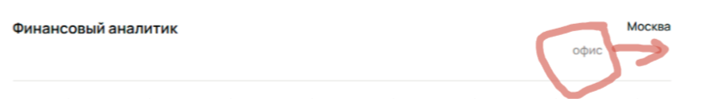
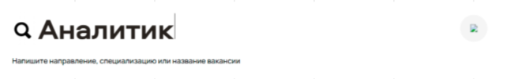
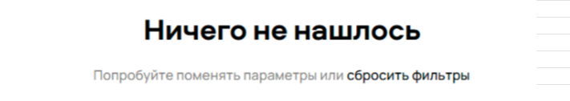

# Список дефектов первого задания
Задача: Изучить скриншот страницы Авито с результатами поиска и перечислить все имеющиеся баги с указанием их приоритета (high, medium, low).  

---

# Дефекты:
## 1. Клиентский сервис указано 2 вакансии, а по факту 1
Приоритет: **medium** 

- 

## 2. Отсуп описания вакансии смещен к центру
Приоритет: **low** 

- 

## 3. Отсутсвует значек стрелочки
Приоритет: **low** 

- 

## 4. Формат работы у финасового аналитика должен быть выровнен по правому краю.
Приоритет: **low** 

- 

## 5. Не указан город для вакансии "Аналитик данных в бизнес-команду Авито Авто"
Приоритет: **high** 

- 

## 6. Не отображается изображение поисковой строки
Приоритет: **medium** 

- 

## 7. Фильтр "Город" не работает, показывает вакансии других городов.
Приоритет: **medium** 

- 

## 8. Поиск успешный. "Ничего не нашлось" выведено ошибочно 
Приоритет: **medium** 

- 

## 9. Ошибка в тексте "Telegram"
Приоритет: **low** 

- 

